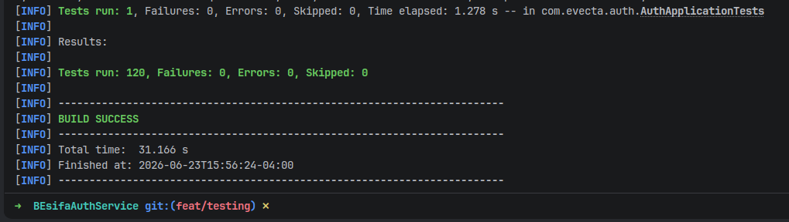
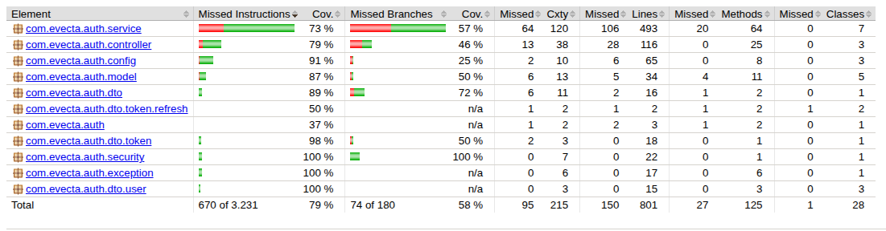
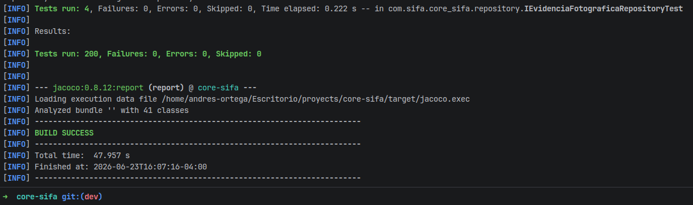
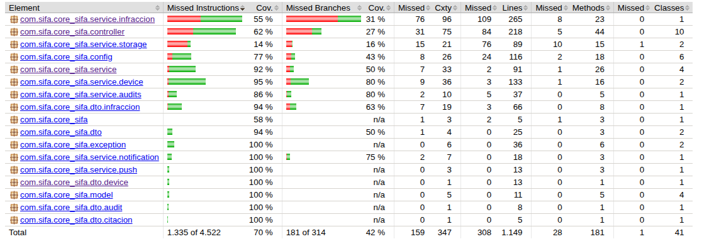
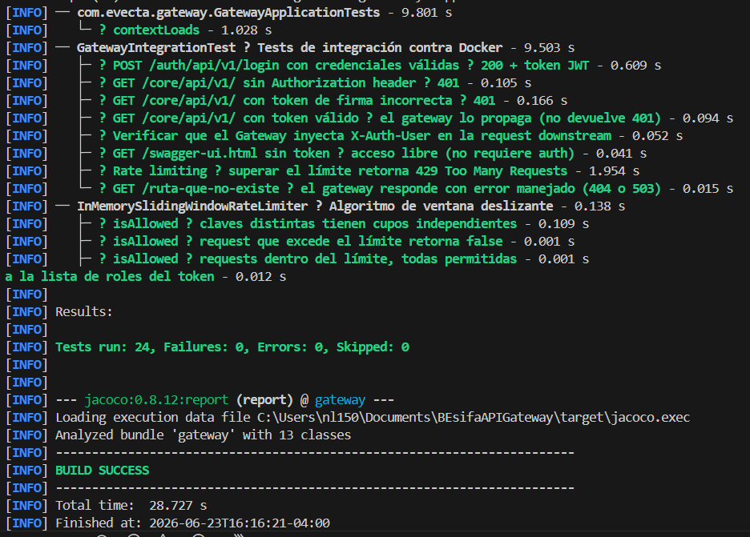
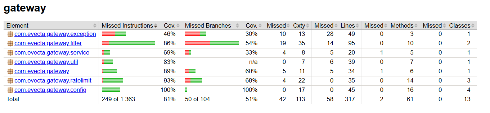

# ANEXO A — Plan de Pruebas SIFA

| Versión | Fecha | Autor | Descripción |
|---------|-------|-------|-------------|
| 1.0 | Junio 2026 | Equipo SIFA | Versión inicial del documento |
| 1.1 | Junio 2026 (rev 1.1) | Equipo SIFA | Revisión del documento |

## 1. Plan de Pruebas

### 1.1 Objetivo

Validar que el ecosistema SIFA (Sistema Integrado de Fiscalización Automatizada) cumple con los requisitos funcionales y no funcionales especificados en el ERS, verificando además la correctitud, seguridad, integridad y usabilidad de los seis módulos que componen la solución: API Gateway, Auth Service, Core Service, Plate Detector, Dashboard Web y App Móvil.

### 1.2 Alcance

El plan cubre pruebas sobre los siguientes proyectos:

| Proyecto | Tecnología | Propósito |
|----------|-----------|-----------|
| **Gateway** | Spring Cloud Gateway / Java 17 | Punto único de entrada, enrutamiento, validación JWT, rate limiting |
| **Auth** | Spring Boot 3 / Java 21 / MySQL | Autenticación, registro de usuarios, RBAC, recuperación de contraseña |
| **Core** | Spring Boot 3 / Java 21 / MySQL | Lógica de negocio: infracciones, citaciones, vehículos, auditoría, backups, notificaciones push |
| **Plate** | FastAPI / Python / YOLO + PaddleOCR | Detección y reconocimiento de patentes vehiculares |
| **Dashboard** | React 18 / Vite / Tailwind CSS | Panel web de administración, supervisión y reportes |
| **SIFA_GO** | Kotlin / Jetpack Compose / Android | Aplicación móvil de fiscalización en terreno |

### 1.3 Estrategia de Validación

Se aplican las siguientes estrategias:

- **Pruebas de Funcionalidad**: Verificar cada endpoint y flujo de usuario contra los requisitos del ERS.
- **Pruebas de Integración**: Validar la comunicación entre microservicios (Gateway → Auth, Gateway → Core, Gateway → Plate Detector, App Móvil → Gateway).
- **Pruebas de Seguridad**: Validar JWT, RBAC, protección de endpoints, validación de entrada.
- **Pruebas de Autenticación y Autorización**: Verificar que cada rol accede solo a lo permitido.
- **Pruebas de Validación de Datos**: Verificar formato chileno (RUT, patentes), boundaries, entradas maliciosas.
- **Pruebas de Persistencia**: Verificar creación, lectura, actualización y eliminación de registros en MySQL.
- **Pruebas de API**: Validar códigos HTTP, estructura de respuestas, errores, schemas.
- **Pruebas de Rendimiento**: Verificar tiempos de respuesta de IA (< 3s), APIs (< 2s), ciclo de fiscalización (< 30s).
- **Pruebas de Usabilidad**: Verificar flujos de la app móvil y dashboard.
- **Pruebas de Manejo de Errores**: Validar respuestas ante datos inválidos, servicios caídos, timeouts.

### 1.4 Ambiente de Pruebas

| Recurso | Especificación |
|---------|---------------|
| **Servidor Backend** | AWS EC2 (t3.medium+) con Docker Compose |
| **Base de Datos** | MySQL 8.0 en EC2 separada o RDS |
| **Cliente Web** | Chrome/Edge actuales, resolución 1920×1080 |
| **Cliente Móvil** | Android 7+ (API 24+) con cámara y GPS |
| **Red** | Conexión a internet estable + simulación de baja conectividad |
| **Servicio IA** | GPU opcional (CPU con OMP_NUM_THREADS=2) |

### 1.5 Herramientas Utilizadas

| Herramienta | Uso |
|------------|-----|
| **JUnit 5 + Mockito** | Pruebas unitarias Java (Spring Boot) |
| **Pytest** | Pruebas unitarias Python (FastAPI) |
| **Vitest + Testing Library** | Pruebas unitarias React |
| **JUnit + MockMvc** | Pruebas de controladores Spring |
| **Testcontainers** | Pruebas de integración con MySQL real |
| **H2 (modo MySQL)** | Pruebas de repositorios JPA |
| **Postman / Insomnia** | Pruebas manuales de API |
| **JaCoCo** | Cobertura de código Java |
| **pytest-cov** | Cobertura de código Python |
| **Docker Compose** | Ambiente de pruebas local |

### 1.6 Tipos de Pruebas Aplicadas

| Tipo | Aplica a |
|------|----------|
| Unitarias | Servicios, repositorios, utilidades |
| Integración | Controladores, flujos entre servicios |
| Funcionales | Endpoints individuales |
| Seguridad | JWT, RBAC, validación de entrada |
| Rendimiento | IA (< 3s), APIs (< 2s) |
| Persistencia | CRUD en base de datos |
| API | Schemas, códigos HTTP, errores |
| Usabilidad | Flujos de usuario (móvil y web) |
| Aceptación | Criterios por requisito |

### 1.7 Criterios de Aceptación

- Todos los requisitos funcionales del ERS tienen al menos un caso de prueba asociado.
- 100% de los casos de prueba de alta prioridad ejecutados sin errores bloqueantes.
- Cobertura de código ≥ 70% en módulos críticos (auth, core, gateway).
- Tiempo de respuesta IA < 3 segundos en el 95% de las solicitudes.
- Tiempo de respuesta API < 2 segundos en condiciones normales.
- No se detectan vulnerabilidades críticas de seguridad (JWT, RBAC, inyección).
- Los 4 roles del sistema acceden exclusivamente a las funcionalidades autorizadas.

---

## 2. Matriz de Trazabilidad

| ID Requisito | Nombre | Módulo | Pruebas Asociadas |
|-------------|--------|--------|-------------------|
| **RF-01** | Inicio de sesión seguro | auth, gateway, sifa_go | CP-001, CP-002, CP-003 |
| **RF-02** | Autenticación biométrica | sifa_go | CP-004 |
| **RF-03** | Captura de imagen vehicular | sifa_go | CP-005 |
| **RF-04** | Confirmación de captura | sifa_go | CP-006 |
| **RF-05** | Reconocimiento automático de patente | sifaPlateDetectorBE | CP-007, CP-008, CP-009 |
| **RF-06** | Validación y corrección manual | sifa_go | CP-010 |
| **RF-07** | Registro automático de GPS | sifa_go, BEsifaCoreService | CP-011 |
| **RF-08** | Registro automático de fecha y hora | sifa_go, BEsifaCoreService | CP-012 |
| **RF-09** | Adjuntar evidencia fotográfica | sifa_go, BEsifaCoreService | CP-013 |
| **RF-10** | Consulta de datos del vehículo | BEsifaCoreService, gateway | CP-014 |
| **RF-11** | Emisión de infracción | sifa_go | CP-015 |
| **RF-12** | Envío de infracción al servidor | sifa_go, gateway, BEsifaCoreService | CP-016, CP-017 |
| **RF-13** | Confirmación de registro exitoso | sifa_go, BEsifaCoreService | CP-018 |
| **RF-14** | Modo offline | sifa_go | CP-019 |
| **RF-15** | Firma digital del fiscalizador | sifa_go, BEsifaCoreService | CP-020 |
| **RF-16** | Inicio de sesión con roles | SIFA_Dashboard, auth, gateway | CP-021, CP-022 |
| **RF-17** | Gestión de usuarios | SIFA_Dashboard, auth | CP-023, CP-024 |
| **RF-18** | Bandeja centralizada de infracciones | SIFA_Dashboard, BEsifaCoreService | CP-025 |
| **RF-19** | Búsqueda y filtrado de infracciones | SIFA_Dashboard, BEsifaCoreService | CP-026 |
| **RF-20** | Detalle completo de infracción | SIFA_Dashboard, BEsifaCoreService | CP-027 |
| **RF-21** | Cambio de estado de infracción | SIFA_Dashboard, BEsifaCoreService | CP-028, CP-029 |
| **RF-22** | Generación de PDF de citación | SIFA_Dashboard | CP-030 |
| **RF-23** | Dashboard de métricas | SIFA_Dashboard, BEsifaCoreService | CP-031 |
| **RF-24** | Listado general de inspecciones | SIFA_Dashboard, BEsifaCoreService | CP-032 |
| **RF-25** | Listado de fiscalizadores | SIFA_Dashboard, BEsifaCoreService | CP-033 |
| **RF-26** | Reportes operacionales | SIFA_Dashboard, BEsifaCoreService | CP-034 |
| **RF-27** | Tabla de auditoría | SIFA_Dashboard, BEsifaCoreService, auth | CP-035 |
| **RF-28** | Recepción y almacenamiento de infracciones | BEsifaCoreService | CP-036, CP-037 |
| **RF-29** | Almacenamiento de evidencia fotográfica | BEsifaCoreService | CP-038 |
| **RF-30** | Registro de auditoría | BEsifaCoreService, auth | CP-039 |
| **RF-31** | API REST | gateway, auth, BEsifaCoreService, sifaPlateDetectorBE | CP-040 |
| **RF-32** | Procesamiento de imágenes con IA | sifaPlateDetectorBE | CP-041, CP-042 |
| **RF-33** | Validación de integridad de datos | BEsifaCoreService, auth | CP-043 |
| **RF-34** | Exportación de archivos | SIFA_Dashboard, BEsifaCoreService | CP-044 |
| **RF-35** | Exportación masiva de infracciones | SIFA_Dashboard, BEsifaCoreService | CP-045 |
| **RF-36** | Integración con servicios externos | BEsifaCoreService | CP-046 |
| **RNF-01** | Tiempo de reconocimiento de patente < 3s | sifaPlateDetectorBE | CP-047 |
| **RNF-02** | Tiempo de respuesta de API < 2s | gateway, auth, BEsifaCoreService | CP-048 |
| **RNF-03** | Concurrencia | gateway, BEsifaCoreService | CP-049 |
| **RNF-04** | Tiempo de envío de infracción < 5s | sifa_go, gateway, BEsifaCoreService | CP-050 |
| **RNF-05** | Ciclo de fiscalización < 30s | sifa_go | CP-051 |
| **RNF-06** | Disponibilidad 99% | gateway, BEsifaCoreService | CP-052 |
| **RNF-07** | Copias de seguridad | BEsifaCoreService, SIFA_Dashboard | CP-053 |
| **RNF-08** | Modo offline | sifa_go | CP-019 |
| **RNF-09** | Autenticación JWT | auth, gateway | CP-054, CP-055 |
| **RNF-10** | Control de acceso RBAC | gateway, auth, BEsifaCoreService | CP-056 |
| **RNF-11** | Trazabilidad (Audit Trail) | BEsifaCoreService, auth | CP-039 |
| **RNF-12** | Protección de datos | auth, BEsifaCoreService | CP-057 |
| **RNF-13** | Cifrado en tránsito | gateway, todos | CP-058 |
| **RNF-14** | Interfaz intuitiva | sifa_go, SIFA_Dashboard | CP-059 |
| **RNF-15** | Minimización de pasos | sifa_go | CP-060 |
| **RNF-16** | Escalabilidad horizontal | gateway, BEsifaCoreService | CP-061 |
| **RNF-17** | Crecimiento de usuarios | auth, BEsifaCoreService | CP-049 |
| **RNF-18** | Arquitectura modular | Todos | — |
| **RNF-19** | Código versionado | Todos | CP-063 |
| **RNF-20** | Actualización de componentes | gateway, BEsifaCoreService | CP-064 |
| **RNF-21** | Compatibilidad móvil Android | sifa_go | CP-065 |
| **RNF-22** | Compatibilidad web | SIFA_Dashboard | CP-066 |
| **RNF-23** | Integridad de datos | BEsifaCoreService | CP-067 |

---

## 3. Casos de Prueba

### 3.1 Autenticación y Seguridad

| ID | Requisito | Componente | Funcionalidad | Acción de Prueba | Resultado Esperado | Tipo de Prueba | Prioridad |
|----|-----------|-----------|--------------|-----------------|-------------------|---------------|-----------|
| **CP-001** | RF-01 | auth | Login exitoso | POST `/auth/api/v1/login` con credenciales válidas de USER_ADMIN | Retorna 200 con accessToken, refreshToken, roles. Token JWT válido por 1 hora. | Funcional | Alta |
| **CP-002** | RF-01 | auth | Login con credenciales inválidas | POST `/auth/api/v1/login` con contraseña incorrecta | Retorna 401 Unauthorized. No se genera token. | Funcional | Alta |
| **CP-003** | RF-01 | auth, sifa_go | Login USER_APP desde web | POST `/auth/api/v1/login` con header `X-Client-Origin: web` y rol USER_APP | Retorna 403. Las cuentas de fiscalizador solo pueden acceder desde app móvil. | Seguridad | Alta |
| **CP-004** | RF-02 | sifa_go | Autenticación biométrica | Configurar huella en dispositivo Android 8+. Iniciar sesión en SIFA GO usando huella. | El dispositivo autentica vía BiometricPrompt. La app obtiene token JWT sin solicitar credenciales manuales. | Funcional | Media |

### 3.2 Aplicación Móvil (SIFA GO)

| ID | Requisito | Componente | Funcionalidad | Acción de Prueba | Resultado Esperado | Tipo de Prueba | Prioridad |
|----|-----------|-----------|--------------|-----------------|-------------------|---------------|-----------|
| **CP-005** | RF-03 | sifa_go | Captura de imagen vehicular | Abrir cámara desde SIFA GO. Enfocar vehículo. Capturar foto. | La imagen se muestra en pantalla de confirmación. Los metadatos EXIF se limpian. | Funcional | Alta |
| **CP-006** | RF-04 | sifa_go | Confirmación/rechazo de captura | Luego de capturar, presionar "Repetir". Luego capturar de nuevo y presionar "Confirmar". | Al repetir vuelve a cámara. Al confirmar avanza al siguiente paso. | Usabilidad | Alta |
| **CP-007** | RF-05 | sifaPlateDetectorBE | Detección de patente con IA | Enviar imagen JPG con patente chilena visible a POST `/plate/api/v1/detect` | Retorna 200 con JSON conteniendo `plate`, `confidence > 0.75`, `bbox`, `status: "OK"`. Tiempo < 3s. | Funcional | Alta |
| **CP-008** | RF-05 | sifaPlateDetectorBE | Detección sin patente visible | Enviar imagen sin vehículo ni patente | Retorna 200 con `result: []` vacío o baja confianza. | Funcional | Alta |
| **CP-009** | RF-05 | sifaPlateDetectorBE | Formato de archivo no soportado | Enviar archivo GIF o PDF | Retorna 400 Bad Request. Solo JPG/PNG aceptados. | Validación | Alta |
| **CP-010** | RF-06 | sifa_go | Corrección manual de patente | Luego de detección automática, editar el texto de la patente detectada. | El campo de texto es editable. Se puede ingresar una patente manualmente. | Funcional | Alta |
| **CP-011** | RF-07 | sifa_go | Registro automático de GPS | Capturar foto en un lugar con GPS activo. Crear infracción. | La infracción incluye coordenadas lat/lng. El mapa en dashboard muestra la ubicación. | Funcional | Alta |
| **CP-012** | RF-08 | sifa_go | Timestamp automático | Realizar captura a las 14:30:00 | El registro incluye timestamp ISO 8601 con hora correcta (America/Santiago). | Funcional | Alta |
| **CP-013** | RF-09 | sifa_go | Adjuntar evidencia fotográfica | Capturar 3 fotos como evidencia y crear infracción | Las 3 fotos se envían como `multipart/form-data`. Se almacenan en S3. | Funcional | Alta |
| **CP-014** | RF-10 | BEsifaCoreService | Consulta de datos del vehículo | GET `/core/api/v1/vehiculos/id/{patente}` con patente existente | Retorna 200 con marca, modelo, año, color, propietario. | Funcional | Alta |
| **CP-015** | RF-11 | sifa_go | Emisión de infracción | Luego de captura, detección, consulta, presionar botón "Cursar infracción" | La infracción se registra con estado "EN PROCESO". Se crea citación automática. | Funcional | Alta |
| **CP-016** | RF-12 | sifa_go | Envío de infracción online | Crear infracción con buena conectividad | La infracción llega al servidor en < 5s. Se almacena en MySQL. | Integración | Alta |
| **CP-017** | RF-12 | gateway | Enrutamiento correcto | App móvil envía request a `/core/api/v1/infracciones` vía gateway:9000 | Gateway enruta a Core Service:8083. Headers `X-Auth-User`, `X-Auth-Roles` inyectados. | Integración | Alta |
| **CP-018** | RF-13 | sifa_go | Confirmación de registro exitoso | Luego de crear infracción exitosamente | Se muestra pantalla de éxito con ID de infracción y mensaje "Infracción registrada exitosamente". | Funcional | Alta |
| **CP-019** | RF-14 | sifa_go | Modo offline | Desactivar conexión de red. Capturar patente. Crear infracción. | **Hallazgo esperado**: No implementado. La app requiere conexión. Sin Room DB ni cola offline. | Funcional | Alta |
| **CP-020** | RF-15 | sifa_go | Firma digital del fiscalizador | Subir imagen de firma desde galería | La imagen se asocia al perfil del fiscalizador. Se incluye en PDF de citación. | Funcional | Media |

### 3.3 Dashboard Web (SIFA Control)

| ID | Requisito | Componente | Funcionalidad | Acción de Prueba | Resultado Esperado | Tipo de Prueba | Prioridad |
|----|-----------|-----------|--------------|-----------------|-------------------|---------------|-----------|
| **CP-021** | RF-16 | SIFA_Dashboard | Login con rol ADMIN | Ingresar credenciales de administrador en `/login` | Redirige a `/dashboard`. Sidebar muestra todas las opciones. | Funcional | Alta |
| **CP-022** | RF-16 | SIFA_Dashboard | Login con rol USER_APP | Ingresar credenciales de fiscalizador en el dashboard web | Muestra error: "Tu cuenta no tiene permisos para acceder a esta plataforma administrativa." | Seguridad | Alta |
| **CP-023** | RF-17 | SIFA_Dashboard, auth | Crear usuario ADMIN | POST a `/auth/api/v1/users` con datos válidos y rol USER_ADMIN | Retorna 200. Se crea usuario en DB. Aparece en listado de usuarios. | Funcional | Alta |
| **CP-024** | RF-17 | auth | Crear usuario sin token ADMIN | POST a `/auth/api/v1/users` con token USER_APP | Retorna 403 Forbidden. | Autorización | Alta |
| **CP-025** | RF-18 | SIFA_Dashboard, BEsifaCoreService | Bandeja de infracciones | GET `/core/api/v1/infracciones/all` con filtros por defecto | Retorna lista paginada con infracciones, cada una mostrando patente, fecha, estado, fiscalizador. | Funcional | Alta |
| **CP-026** | RF-19 | SIFA_Dashboard | Filtros avanzados | Filtrar infracciones por rango de fecha, patente, estado y fiscalizador | La tabla se actualiza mostrando solo las infracciones que cumplen todos los filtros. | Funcional | Alta |
| **CP-027** | RF-20 | SIFA_Dashboard, BEsifaCoreService | Detalle completo de infracción | GET `/core/api/v1/infracciones/id/{id}` y abrir modal de detalle | Muestra: fotos (carrusel), mapa con GPS, datos vehículo, datos infractor, citación, historial de estados. | Funcional | Alta |
| **CP-028** | RF-21 | SIFA_Dashboard, BEsifaCoreService | Aceptar infracción (JPL) | PUT `/core/api/v1/infracciones/{id}/procesar` con estado "APROBADA" | Cambia estado a "accepted". Se registra auditoría con usuario JPL. | Funcional | Alta |
| **CP-029** | RF-21 | SIFA_Dashboard, BEsifaCoreService | Rechazar infracción con motivo | PUT `/core/api/v1/infracciones/{id}/procesar` con estado "RECHAZADA" y motivo | Cambia estado a "rejected". Motivo visible en detalle. | Funcional | Alta |
| **CP-030** | RF-22 | SIFA_Dashboard | Generación de PDF de citación | En detalle de infracción aceptada, presionar "Exportar PDF" | Se descarga PDF con: datos de infracción, firma fiscalizador (transparente), código QR de validación. | Funcional | Alta |
| **CP-031** | RF-23 | SIFA_Dashboard | Dashboard de métricas | Navegar a `/dashboard` | Muestra KPIs (total, pendientes, aceptadas, rechazadas), gráfico de barras por tipo, mapa de calor. | Funcional | Alta |
| **CP-032** | RF-24 | SIFA_Dashboard | Listado de inspecciones | Navegar a `/infracciones` con filtro de fechas | Lista paginada con búsqueda por patente y filtro por estado. | Funcional | Media |
| **CP-033** | RF-25 | SIFA_Dashboard, BEsifaCoreService | Listado de fiscalizadores activos | GET `/core/api/v1/fis-activity/activos` desde dashboard | Muestra fiscalizadores con heartbeat en últimos 10 min, ubicación en mapa. | Funcional | Media |
| **CP-034** | RF-26 | SIFA_Dashboard | Reporte de productividad | Seleccionar fiscalizador y rango de fechas en modal de reportes | Se genera PDF con conteo de infracciones por fiscalizador en el período. | Funcional | Media |
| **CP-035** | RF-27 | SIFA_Dashboard, BEsifaCoreService | Tabla de auditoría | GET `/core/api/v1/internal/audit` con token USER_ADMIN | Retorna registros paginados con: usuario, acción, tabla afectada, timestamp. | Funcional | Alta |

### 3.4 Backend y Servicios

| ID | Requisito | Componente | Funcionalidad | Acción de Prueba | Resultado Esperado | Tipo de Prueba | Prioridad |
|----|-----------|-----------|--------------|-----------------|-------------------|---------------|-----------|
| **CP-036** | RF-28 | BEsifaCoreService | Recepción de infracción vía multipart | POST `/core/api/v1/infracciones` con JSON + fotos | Almacena infracción en DB. Fotos en S3. Crea citación. Retorna 201 con ID. | Funcional | Alta |
| **CP-037** | RF-28 | BEsifaCoreService | Rollback en fallo de persistencia | POST `/core/api/v1/infracciones` con datos inválidos | Si falla la transacción DB, las fotos subidas a S3 se eliminan (rollback manual en código). | Integridad | Alta |
| **CP-038** | RF-29 | BEsifaCoreService | Almacenamiento de evidencias | Revisar estructura S3 tras crear infracción | Fotos almacenadas en `infracciones/{PATENT}/{PATENT}_{timestamp}_{index}.jpg`. | Persistencia | Alta |
| **CP-039** | RF-30, RNF-11 | BEsifaCoreService, auth | Registro de auditoría en acción crítica | Procesar infracción (aceptar/rechazar). Luego consultar auditoría. | Se registra: email usuario, acción "PROCESAR_INFRACCION", tabla "Infraccion", id del registro, timestamp. | Funcional | Alta |
| **CP-040** | RF-31 | gateway, BEsifaCoreService, sifaPlateDetectorBE | Salud de API REST | GET a `/v3/api-docs` (auth), `/core/v3/api-docs` (core), `openapi.json` (plate) | Swagger docs retornan esquemas completos de endpoints. | API | Alta |
| **CP-041** | RF-32 | sifaPlateDetectorBE | Pipeline IA completo | Enviar imagen JPG con patente chilena nueva (ej: TZPW11) | YOLO detecta bounding box → PaddleOCR extrae texto → corrige con heurísticas → retorna "TZPW11". | Funcional | Alta |
| **CP-042** | RF-32 | sifaPlateDetectorBE | Timeout en procesamiento IA | Enviar imagen muy grande (> 5 MB) o corrupta | Retorna 408 tras 5 segundos. Imagen temporal eliminada. | Rendimiento | Alta |
| **CP-043** | RF-33 | BEsifaCoreService | Validación de datos de entrada | POST `/core/api/v1/infracciones` sin campo `patenteVehiculo` | Retorna 400 con mensaje de error de validación. | Validación | Alta |

### 3.5 Integración y Exportación

| ID | Requisito | Componente | Funcionalidad | Acción de Prueba | Resultado Esperado | Tipo de Prueba | Prioridad |
|----|-----------|-----------|--------------|-----------------|-------------------|---------------|-----------|
| **CP-044** | RF-34 | SIFA_Dashboard | Exportación a PDF | En infracción aceptada, generar PDF de citación | PDF descargable contiene: logo municipal, datos infracción, QR, firma. | Funcional | Media |
| **CP-045** | RF-35 | BEsifaCoreService, SIFA_Dashboard | Exportación masiva CSV | GET `/core/api/v1/infracciones/export/csv` con filtros (fechas, estado, fiscalizador, búsqueda). Botón "Exportar CSV" en el Dashboard. | Retorna archivo CSV con separador `;` y header `Content-Disposition: attachment`. Contiene todas las infracciones filtradas con datos completos (patente, vehículo, propietario, tipo, ubicación, estado, fechas, fotos). | Funcional | Media |
| **CP-046** | RF-36 | BEsifaCoreService | Integración externa vehículos | Consultar vehículo por patente existente | Datos de vehículo mock devueltos (no hay API externa real conectada). | Integración | Media |

### 3.6 Rendimiento

| ID | Requisito | Componente | Funcionalidad | Acción de Prueba | Resultado Esperado | Tipo de Prueba | Prioridad |
|----|-----------|-----------|--------------|-----------------|-------------------|---------------|-----------|
| **CP-047** | RNF-01 | sifaPlateDetectorBE | Tiempo de reconocimiento < 3s | Enviar 100 imágenes de patentes. Medir tiempo promedio. | 95% de las detecciones completan en < 3s. Timeout configurado a 5s. | Rendimiento | Alta |
| **CP-048** | RNF-02 | gateway, auth | Tiempo de respuesta API < 2s | Medir latencia de POST `/auth/api/v1/login` | Response time < 2s en condiciones normales. | Rendimiento | Alta |
| **CP-049** | RNF-03, RNF-17 | gateway | Concurrencia de usuarios | Ejecutar 50 requests concurrentes a infracciones endpoint | Gateway responde correctamente (rate limiting 100 req/60s por IP+path). Sin errores 5xx. | Rendimiento | Alta |
| **CP-050** | RNF-04 | sifa_go, BEsifaCoreService | Tiempo de envío de infracción < 5s | Crear infracción con 3 fotos desde app, medir tiempo desde "Enviar" hasta confirmación | < 5s con conectividad estable. | Rendimiento | Alta |
| **CP-051** | RNF-05 | sifa_go | Ciclo de fiscalización < 30s | Medir tiempo total desde abrir cámara hasta confirmación de infracción | Tiempo total < 30s (ideal < 10s). | Rendimiento | Alta |

### 3.7 Disponibilidad y Resiliencia

| ID | Requisito | Componente | Funcionalidad | Acción de Prueba | Resultado Esperado | Tipo de Prueba | Prioridad |
|----|-----------|-----------|--------------|-----------------|-------------------|---------------|-----------|
| **CP-052** | RNF-06 | gateway | Disponibilidad de servicios | Detener Core Service. Consultar gateway. | Gateway retorna 503 "Servicio no disponible" con JSON estructurado. Error no es 500. | Resiliencia | Alta |
| **CP-053** | RNF-07 | BEsifaCoreService, SIFA_Dashboard | Creación de backup completo | POST `/core/api/v1/admin/backups/full` con token USER_ADMIN | Inicia job asíncrono. Job se completa con estado SUCCESS. Backup aparece en listado. | Funcional | Alta |

### 3.8 Seguridad y Autorización

| ID | Requisito | Componente | Funcionalidad | Acción de Prueba | Resultado Esperado | Tipo de Prueba | Prioridad |
|----|-----------|-----------|--------------|-----------------|-------------------|---------------|-----------|
| **CP-054** | RNF-09 | gateway | Doble validación JWT | Enviar token JWT válido pero revocado en DB | Gateway valida localmente (firma OK) y remotamente (auth-service: token revocado). Retorna 401. | Seguridad | Alta |
| **CP-055** | RNF-09 | auth | Refresh token rotation | POST `/auth/api/v1/login`, luego POST `/auth/api/v1/refresh` con refreshToken | Nuevos access + refresh tokens emitidos. Viejos revocados. | Seguridad | Alta |
| **CP-056** | RNF-10 | BEsifaCoreService | RBAC en Core Service | USER_APP intenta GET `/core/api/v1/admin/backups` | Retorna 403. El `RoleHeaderFilter` + `@PreAuthorize` bloquean. | Autorización | Alta |
| **CP-057** | RNF-12 | auth | Validación de entrada (RUT) | POST `/auth/api/v1/users` con RUT inválido "12345678-0" | Retorna 400 con error de validación de RUT chileno (módulo 11). | Validación | Alta |
| **CP-058** | RNF-13 | gateway | CORS restrictivo | Request desde origin no listado | Gateway bloquea el request CORS. Solo origins autorizados: localhost:5173, sifacore.netlify.app, etc. | Seguridad | Alta |

### 3.9 Manejo de Errores

| ID | Requisito | Componente | Funcionalidad | Acción de Prueba | Resultado Esperado | Tipo de Prueba | Prioridad |
|----|-----------|-----------|--------------|-----------------|-------------------|---------------|-----------|
| **CP-059** | RNF-14 | gateway | Error 404 manejado | GET a ruta inexistente `/api/non-existent` | Gateway retorna 404 con JSON `{error, mensaje, timestamp}`. No HTML. | Manejo Errores | Media |
| **CP-060** | RNF-15 | auth | Error 500 manejado globalmente | Enviar payload malformado a endpoint | `GlobalExceptionHandler` captura excepción. Retorna JSON con mensaje amigable, código de error, timestamp. | Manejo Errores | Alta |

### 3.10 Persistencia y Base de Datos

| ID | Requisito | Componente | Funcionalidad | Acción de Prueba | Resultado Esperado | Tipo de Prueba | Prioridad |
|----|-----------|-----------|--------------|-----------------|-------------------|---------------|-----------|
| **CP-061** | RNF-23 | BEsifaCoreService | Integridad transaccional | Intentar crear infracción con patente de vehículo inexistente | Transacción completa falla (ALL OR NOTHING). Fotos subidas se eliminan de S3 (rollback manual). | Persistencia | Alta |
| **CP-063** | RF-28 | BEsifaCoreService | DDL automático de tablas | Verificar que Hibernate crea tablas correctamente | Tablas: INFRACCIONES, EVIDENCIAS_FOTOGRAFICAS, CITACIONES, VEHICULOS, AUDIT_LOGS, etc. creadas con schema correcto. | Persistencia | Alta |

### 3.11 Rate Limiting (Feature extra)

| ID | Requisito | Componente | Funcionalidad | Acción de Prueba | Resultado Esperado | Tipo de Prueba | Prioridad |
|----|-----------|-----------|--------------|-----------------|-------------------|---------------|-----------|
| **CP-064** | — (extra) | gateway | Rate limiting por IP | Enviar 101 requests a `/auth/api/v1/login` desde misma IP en 60s | Request 101 retorna 429 Too Many Requests con header `Retry-After`. | Rendimiento | Media |
| **CP-065** | — (extra) | gateway | Rate limiting por ruta | Enviar 201 requests totales a cualquier ruta desde misma IP en 60s | Request 201 retorna 429. Catch-all configurado a 200/60s. | Rendimiento | Media |

### 3.12 Push Notifications (Feature extra)

| ID | Requisito | Componente | Funcionalidad | Acción de Prueba | Resultado Esperado | Tipo de Prueba | Prioridad |
|----|-----------|-----------|--------------|-----------------|-------------------|---------------|-----------|
| **CP-066** | — (extra) | BEsifaCoreService | Envío de notificación push single | POST `/core/api/v1/notifications/push` con token FCM válido y mensaje | Notificación recibida en dispositivo Android destino. | Integración | Media |
| **CP-067** | — (extra) | BEsifaCoreService | Registro de device token | POST `/core/api/v1/devices/register` con FCM token | Token almacenado en DEVICE_TOKENS con estado ACTIVE. | Funcional | Media |

---

## 4. Ejecución de Pruebas

Los CPs marcados con test automatizado tienen cobertura con JUnit/Vitest/pytest. Las
imágenes de evidencia agrupan la ejecución de los test suites y cobertura:

 — Test suite del proyecto `auth`
 — Cobertura del proyecto `auth`
 — Test suite del proyecto `BEsifaCoreService`
 — Cobertura del proyecto `BEsifaCoreService`
 — Test suite del proyecto `gateway`
 — Cobertura del proyecto `gateway`

| ID | Resultado Esperado | Evidencia |
|----|-------------------|-----------|
| CP-001 a CP-004, CP-054, CP-055 | Autenticación y seguridad (login, JWT, roles, biometría) |  |
| CP-005 a CP-067 | Resto de pruebas (app móvil, dashboard, backend, exportación, rendimiento, etc.) |  |
| — | Cobertura de código del proyecto auth |  |
| — | Cobertura de código del proyecto core |  |
| — | Test suite del proyecto `gateway` |  |
| — | Cobertura de código del proyecto `gateway` |  |

---

## 5. Hallazgos y Mejoras

| ID | Hallazgo | Riesgo | Impacto | Corrección Aplicada | Beneficio |
|----|----------|--------|---------|-------------------|-----------|
| **H-01** | **Modo offline no implementado** en sifa_go. No existe Room DB, DAOs, WorkManager ni cola de sincronización. | Alto | Los fiscalizadores no pueden operar en zonas sin conectividad. Incumple RF-14 y RNF-08. | **Se pasa para próxima versión.** Room DB para almacenamiento local, WorkManager para sincronización diferida. | Fiscalizadores pueden operar en todo el territorio municipal sin depender de conectividad. |
| **H-02** | Endpoint `GET /core/api/v1/infracciones/export/csv` con botón "Exportar CSV" en el Dashboard. | ~~Medio~~ | ~~Los administrativos JPL no pueden exportar grandes volúmenes de datos.~~ | Endpoint implementado en `InfraccionController.java` con OpenCSV, separador `;`, filtros reutilizados del listado paginado. Botón "Exportar CSV" en `InfractionsFilters.jsx`. Test en `InfraccionControllerTest.java`. | JPL puede exportar infracciones filtradas a CSV para análisis forense y reportería externa. |
| **H-03** | **Sin pruebas unitarias en auth y gateway**. Ambos proyectos tienen solo el test de contexto de Spring Boot. Sin cobertura para lógica JWT, RBAC, filtros, servicios. | Alto | Riesgo de regresiones en componentes críticos de seguridad y enrutamiento. | Pendiente de implementar: tests unitarios con JUnit + Mockito para servicios, controladores y filtros. | Detección temprana de regresiones en seguridad. |
| **H-04** | **`ddl-auto=update` en producción**. Hibernate crea/altera schemas automáticamente en todos los entornos. | Medio | Cambio accidental de schema en producción. Sin control de migraciones. | Cambiar a `ddl-auto=validate` en producción y gestionar migraciones manualmente con scripts SQL nativos de MySQL. | Control de cambios en BD sin depender de Hibernate. |
| **H-06** | **Firma digital del fiscalizador**. No se encontró implementación para subir/almacenar imagen de firma (RF-15). El modelo FiscalizadorPresencia no tiene campo firma_url. | Medio | La citación PDF no incluiría firma digital del fiscalizador. | **Se pasa para próxima versión.** Implementar en sifa_go (carga de firma) y Core Service (almacenamiento asociado al fiscalizador). | Citaciones legalmente válidas con firma oficial. |
| **H-07** | **Sin monitoreo ni métricas**. No se implementaron endpoints Actuator/Prometheus para monitoreo de salud y métricas de los microservicios. | Medio | Sin visibilidad del estado de salud de los servicios en producción. | **Se pasa para próxima versión.** Agregar Spring Boot Actuator + Micrometer + exportación a Prometheus/Grafana. | Monitoreo proactivo, alertas, SLAs. |
| **H-08** | **Integración con API externa de vehículos no implementada**. RF-36 especifica integración con servicios externos. Solo existen datos mock (DataInitializerConfig). | Medio | Datos vehiculares limitados a mock. No hay consulta a registro civil o padrón. | Pendiente para próxima versión, hasta que el cliente pueda proveer el servicio externo. | Datos vehiculares reales para la fiscalización. |
| **H-09** | **Rate limiting implementado**. Mecanismo de ventana deslizante in-memory configurado en gateway con reglas por ruta. | Bajo | Protege contra uso abusivo de la API. | Ya implementado. Ajustar thresholds según carga real en producción. | Protección contra fuerza bruta y DoS. |

---

## 6. Fundamentación Técnica

### 6.1 Pruebas de Autenticación y Seguridad (CP-001 a CP-004, CP-054 a CP-058)

**Qué validan**: Verifican que el mecanismo JWT + RBAC funciona correctamente en los tres niveles (gateway → auth service → core service), que los tokens se emiten, validan, refrescan y revocan adecuadamente, y que cada rol solo accede a lo autorizado.

**Riesgo que mitigan**: Acceso no autorizado al sistema, suplantación de identidad, escalamiento de privilegios, exposición de datos sensibles.

**Estándar de calidad**: ISO/IEC 27001 (controles de acceso), OWASP Top 10 (A1-Broken Access Control, A2-Cryptographic Failures).

**Aporte**: La autenticación JWT con doble validación (local + remota) y RBAC con 4 roles cubre los pilares de **Seguridad** y **Probidad** de SIFA. Garantiza que solo usuarios autorizados accedan a funcionalidades específicas.

### 6.2 Pruebas de Aplicación Móvil (CP-005 a CP-020)

**Qué validan**: El flujo completo de fiscalización desde la app Android: captura de imagen, detección de patente, registro GPS, consulta de vehículo, creación de infracción y modo offline.

**Riesgo que mitigan**: Fallos en terreno que impidan al fiscalizador completar su labor, pérdida de datos por falta de conectividad, errores en la captura de evidencia.

**Estándar de calidad**: Android Compatibility Definition Document (CDD), ISO 25010 (Product Quality).

**Aporte**: Cubre el pilar de **Eficiencia Operativa** al validar que el ciclo de fiscalización se completa en < 30 segundos con "One-Tap". La detección de patente con IA + corrección manual asegura precisión en el reconocimiento.

### 6.3 Pruebas de Dashboard Web (CP-021 a CP-035)

**Qué validan**: Las funcionalidades administrativas del panel web: login con roles, CRUD de usuarios, bandeja de infracciones con filtros, detalle de infracción, cambio de estados, generación de PDF, dashboard de métricas, reportes y auditoría.

**Riesgo que mitigan**: Errores en la gestión de infracciones (aceptar/rechazar incorrectamente), pérdida de trazabilidad, falta de control sobre usuarios del sistema.

**Estándar de calidad**: WCAG 2.1 (accesibilidad), ISO 25010 (usabilidad), GDPR/Ley de Protección de Datos (auditoría).

**Aporte**: El dashboard materializa los pilares de **Probidad y Transparencia** (auditoría de todas las acciones) y **Eficiencia Operativa** (gestión centralizada de infracciones con flujo de aprobación digital).

### 6.4 Pruebas de Backend y Servicios (CP-036 a CP-043)

**Qué validan**: La capa de servicios backend: recepción y almacenamiento de infracciones con fotos, registro de auditoría, APIs REST, pipeline de IA, validación de integridad de datos.

**Riesgo que mitigan**: Pérdida de datos de infracciones, almacenamiento incorrecto de evidencia, fallos silenciosos en registros de auditoría, corrupción de datos.

**Estándar de calidad**: ISO 25010 (reliability, data integrity), ACID properties (transaccionalidad).

**Aporte**: El backend con Spring Boot 3 + JPA + MySQL garantiza la **integridad transaccional** (rollback de fotos en S3 si falla la BD) y la **trazabilidad** (auditoría en cada acción crítica).

### 6.5 Pruebas de Integración y Exportación (CP-044 a CP-046)

**Qué validan**: La comunicación entre microservicios a través del API Gateway, la exportación de PDF de citación y la integración con servicios externos.

**Riesgo que mitigan**: Fallos en la comunicación entre servicios, datos incorrectos en citaciones oficiales, incompatibilidad con estándares externos.

**Estándar de calidad**: ISO 25010 (interoperability), estándar CAS Chile para exportación.

**Aporte**: La **interoperabilidad** entre los 4 microservicios backend y los 2 frontends garantiza que el ecosistema funcione como un todo cohesionado.

### 6.6 Pruebas de Rendimiento (CP-047 a CP-051)

**Qué validan**: Los tiempos de respuesta críticos especificados en RNF-01 a RNF-05: reconocimiento de patente < 3s, API < 2s, envío de infracción < 5s, ciclo completo < 30s.

**Riesgo que mitigan**: Degradación del rendimiento que afecte la experiencia del fiscalizador en terreno, incumplimiento de SLAs.

**Estándar de calidad**: ISO 25010 (performance efficiency), SLAs definidos en ERS.

**Aporte**: Los tiempos de respuesta son críticos para el pilar de **Seguridad y Resiliencia del Funcionario**: un ciclo de fiscalización rápido minimiza la exposición del fiscalizador en la vía pública.

### 6.7 Pruebas de Disponibilidad y Resiliencia (CP-052 a CP-053)

**Qué validan**: La capacidad del sistema para manejar fallos de servicios downstream y la funcionalidad de backup/restore.

**Riesgo que mitigan**: Caída total del sistema por fallo de un componente, pérdida irreversible de datos.

**Estándar de calidad**: ISO 25010 (availability, fault tolerance), SLA 99% disponibilidad.

**Aporte**: La arquitectura de microservicios con gateway que detecta servicios caídos (503 "Servicio no disponible") y el sistema de backups completos garantizan la **continuidad operativa** del sistema municipal.

### 6.8 Pruebas de Rate Limiting y Push Notifications (CP-064 a CP-067)

**Qué validan**: Funcionalidades extra implementadas que no están en el ERS pero que agregan valor al sistema.

**Riesgo que mitigan**: Abuso de API (rate limiting), comunicación desconectada con fiscalizadores (push notifications).

**Estándar de calidad**: OWASP (rate limiting para prevenir brute force), FCM estándar de Google.

**Aporte**: El rate limiting protege contra ataques de fuerza bruta y uso abusivo de la API, mientras que las notificaciones push mejoran la **comunicación en terreno** con los fiscalizadores.

---

**Fin del Plan de Pruebas — Anexo A de ERS SIFA v1.1**
